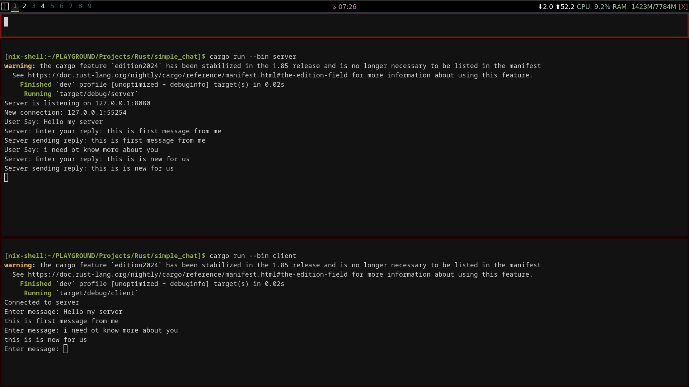

# Simple Chat (Rust)  

A basic chat application written in Rust, consisting of a client and server for simple message exchange.  \

> Real Example


## Features  
- 🚀 Basic TCP client/server communication  
- ✉️ Send and receive text messages  
- 🔌 Handle multiple client connections (if implemented)  
- 📡 Simple networking using Rust's `std::net`  

## How to Run  
1. **Start the server**:  
   ```sh  
   cargo run --bin server  
   ```  

2. **Start the client**:  
   ```sh  
   cargo run --bin client  
   ```  

3. ✏️ Type messages in the client and press Enter to send.  
4. 🛑 Use `Ctrl+C` to exit.  

## Project Structure  
- `src/main.rs` → Client/Server entry point (or split into `client.rs` & `server.rs`)  
- `Cargo.toml` → Project config and dependencies  
- `target/` → Build artifacts (ignored in Git)  

## Dependencies  
- Rust standard library (`std::net`)  
- (Optional) `ctrlc` for graceful shutdown handling  

## Future Improvements  
- 🔐 Add encryption (e.g., TLS)  
- 👥 Support multiple clients concurrently  
- 🎨 Better UI (e.g., with `ncurses` or TUI)  

---  
